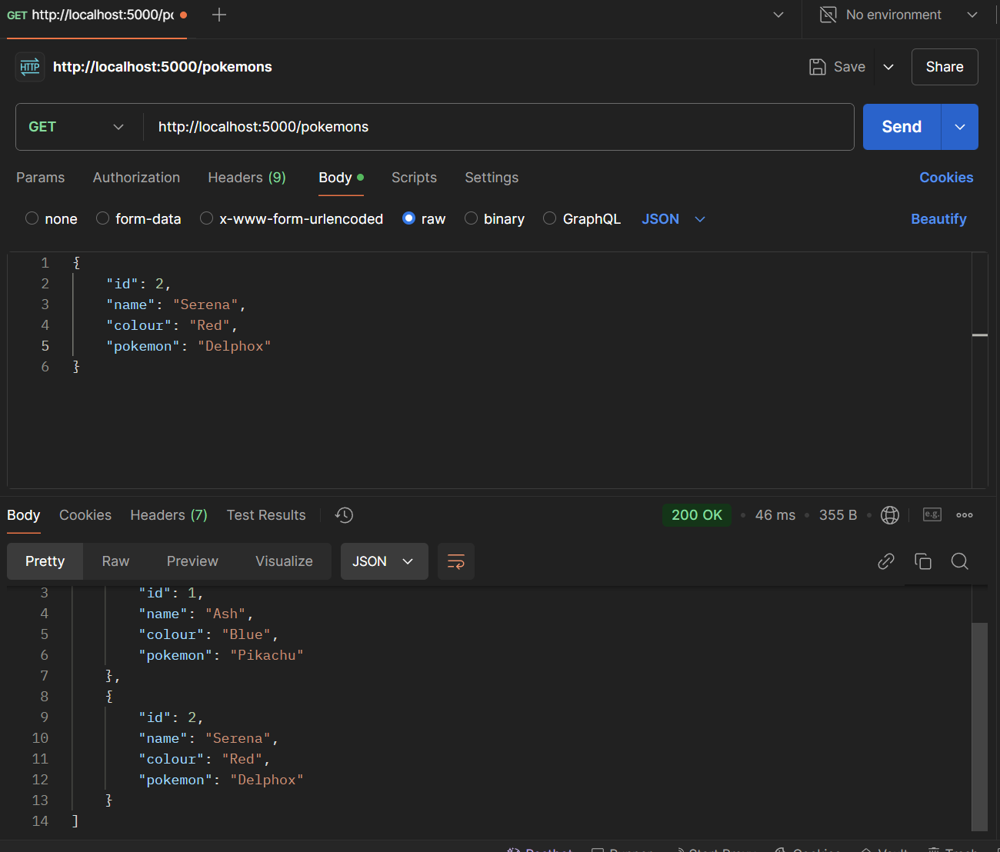

# CRUD-Environments-Branching
This is an assignment which was provided to us during Software Integration course.

## Brief Overview of the assignment
- The application has minimal services (CRUD).
- Application is attached to a database (PostgreSQL)
- The main point of this assignment is for the professor to see the **GitHub workflow, Pull Requests, Commit etc**.
- **ALSO MAKE SURE TO CHANGE CONTENTS IN `.env` FILE AND UPDATE IT WITH THE DETAILS OF THE DATABASE SERVER YOU ARE RUNNING IN YOUR SERVER**

### Breaking down the Coding part of this assignment
- First of all, NodeJS is used for this application.
- `db.js` This is responsible for the basic DB connection.
- `app.js` Sets up server, connects to db etc.
- `pokemonModel.js` This is responsible for the creation of table.
- `pokemonController.js` As the name suggest, it handles the CRUD functionalities of this application.
- `pokemonRoutes.js` This handles the API endpoints for the data
**An example of a CRUD function in action (POST and GET in this case).**

**Here, POSTMAN is used for checking out the CRUD functions(UPDATE and DELETE works too).**

